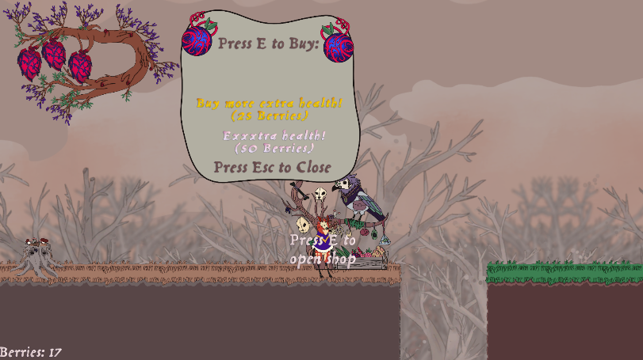
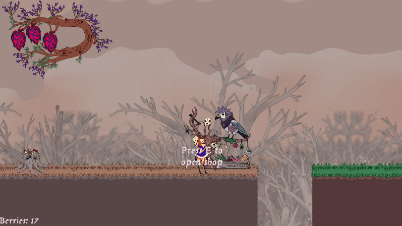
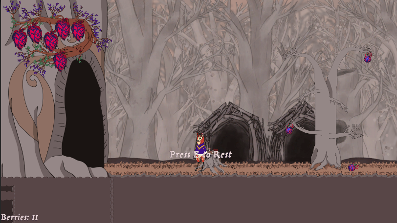
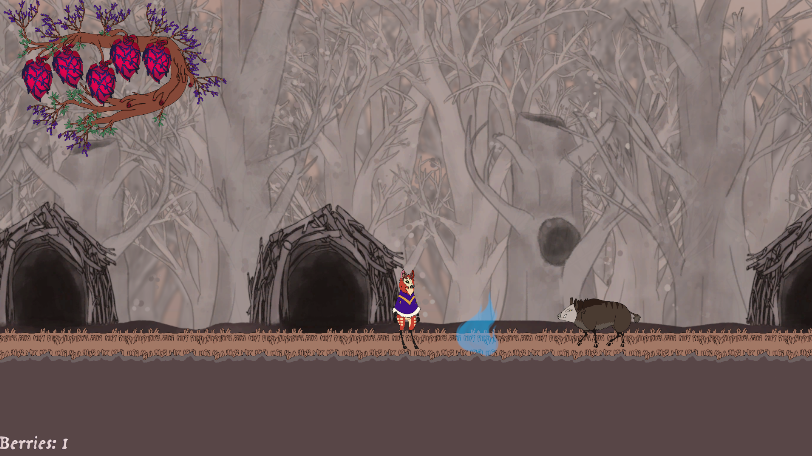
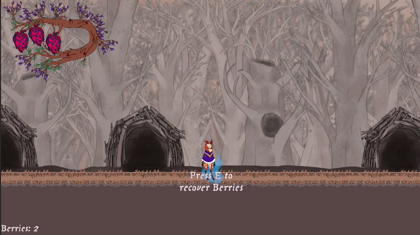

# GameProgramming-Portfolio

Hello! I'm a game programming student at Taitotalo.

This repository showcases programming work completed during my studies and game development projects.

## Skills

- C#
- Unity
- Gameplay Programming
- UI Systems
- Debugging

## Featured Project

A 2D Metroidvania game developed as a group project during my game programming studies.

### Metroidvania Group Project "BAMBO"

My responsibilities included:

- Respawn System
- Checkpoint / Rest System
- Player Interaction System
- Forest Echo Recovery System
- Shop System
- Cutscene System

## Core Systems

### Shop System

A merchant-based upgrade system that allows players to purchase permanent health upgrades using collected currency. 

#### Features

- Trigger-based shop interactions
- Upgrade purchasing and progression
- Shopkeeper animation and audio feedback
- Dynamic menu navigation
- UI prompts and interaction handling
- Persistent upgrade state

#### Main Scripts
- `ShopSystem`
- `ShopUI`
- `ShopTrigger`
- `ShopkeeperFeedback`

---

### Checkpoint & Respawn System

A checkpoint system that tracks player progress and provides reliable respawn functionality.

#### Features

- Checkpoint activation and registration
- Automatic respawn after death
- Health restoration on respawn
- Save/load integration
- Checkpoint resting functionality
- Enemy reset support

#### Main Scripts

- `Checkpoint`
- `CheckpointManager`
- `CheckpointRest`
- `PlayerRespawn`

---

### Forest Echo System

A death-recovery mechanic inspired by soulslike games.

When the player dies, carried currency is dropped at the death location as an Echo.
Returning to that location allows the player to recover lost currency.

#### Features

- Currency recovery after death
- Currency loss on death
- Single active Echo management
- Interaction prompt system
- Death location tracking
- Automatic cleanup of previous Echoes

#### Main Scripts

- `Echo`
- `ForestEchoManager`
- `EchoPromptUI`

---

### Cutscene System

A fully integrated cutscene framework built using Unity's VideoPlayer.

#### Features

- Intro cutscenes
- Collectible-triggered cutscenes
- Multiple ending cutscenes
- Video playback across scene transitions
- Automatic player control locking
- UI hiding during cutscenes
- Gameplay audio muting
- Ending credits system
- Optional credits music support

#### Main Scripts

- `CutsceneManager`
- `IntroCutsceneStarter`
- `CutscenePickup`
- `EndingCutsceneTrigger`

--- 

### Player Interactor System

A centralized interaction system for handling contextual gameplay interactions.

#### Features

- Shop interactions
- Echo recovery interactions
- Checkpoint resting interactions
- Context-sensitive interaction prompts
- Unity Input System integration

#### Main Scripts

- `PlayerInteractor`

## Technical Features

- Unity Input System
- ScriptableObject support
- Scene transitions
- Video cutscenes
- Audio Management
- Event-driven gameplay systems
- Singleton-based managers

## Screenshots

### Shop System

### Checkpoint & Respawn System

### Forest Echo System

## Demo Gameplay Videos

### Shop System

[Shop System Demo](https://youtu.be/TIpo_2qcRBE?si=lpxOdrns4plO5B3z)

### Checkpoint & Rest System

[Checkpoint & Rest System Demo](https://youtu.be/B8xyV9Snspg?si=3HOxB1TVWc4QPtT-)

### Forest Echo + Respawn System

[Forest Echo + Respawn System Demo](https://youtu.be/247q80k-P8s?si=NzNxoXRgIO6esLav)

### Cutscene System

[Cutscene System Demo](https://youtu.be/NScQ_ZYpguI?si=PN60iiFqu-pWffHW)

## Source Code

Example scripts are organized by gameplay system in the `Scripts` folder.

## Notes

The cutscene videos themselves were created by the project's artists. My contribution was the implementation of the cutscene system, including video playback, scene transitions, ending logic, credits handling, player locking, and audio management.
